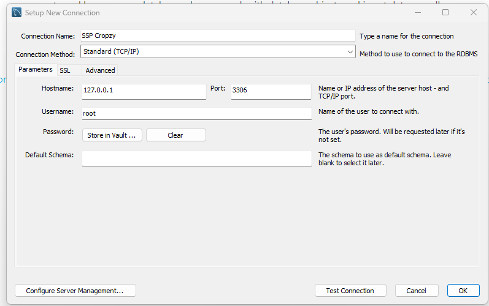
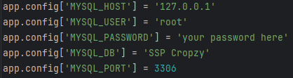
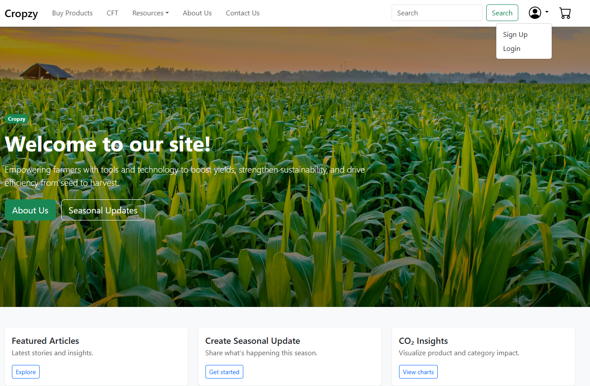

# NYP Y2 S1 System Security Project IT2656

The objective of this project is for students to apply the knowledge and skills acquired to demonstrate insecure and secure web applications/APIs/Systems and develop secure web applications, including systems.

#### Project Description
Cropzy is an all in one platform which aims to equip farmers with the resources and tools to optimize productivity/crop yield while prioritizing sustainability.

## Python Version
Python 3.11.0

## Features: 
- Sustainable Eco-Friendly Agricultural Products on sale
- Tools such as Carbon Footprint Tracker, Crop Calendar, Seasonal Updates
- Resources such as news articles, educational videos, related information like soil information, Chatbot

## !! Important !!

Some features may not work as intended as sensitive values (API keys, secret keys, database credentials) have been removed for security reasons.

To run the project locally, you will need to:

- Set up your own `.env` file with the required environment variables (see `.env` for reference).
- Provide your own API keys/secrets (e.g., Google, Twilio, Stripe, reCAPTCHA).
- Ensure all dependencies are installed.
- Ensure a MySQL database connection has been set up 

## Instructions:

### Install MySQL, Set Up Database Connection and Run given script
- Install MySQL Workbench here: https://dev.mysql.com/downloads/installer/
- Create a new connection: 
  - Example: 
- Log in to root and run the sql script: [DB Scripts](https://github.com/Diablo2912/NYP-Y2-S1-System-Security-Project/blob/master/db_script.sql)
- Change details on line 148-152 in __init__.py:
  - Example: 
  

### Install Required Dependencies

```bash
  pip install -r requirements.txt
```

### Run application
Once everything has been set up, run the __init__.py file. Wait for the application to load and click the link in your __Run__ terminal.

### Additional Info 
Once in the application, create an account and login to explore the website's features
